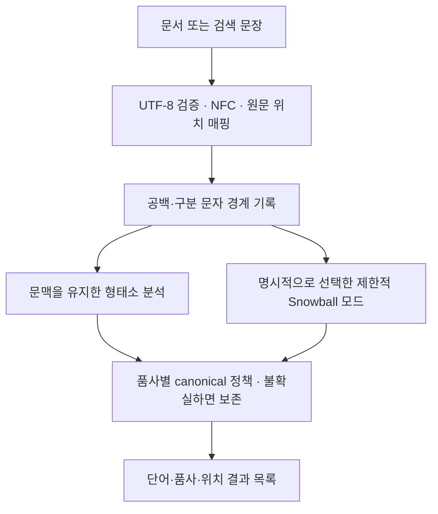

# 한국어 Snowball 및 형태소 분석 어댑터 설계

- 작성일: 2026-09-09 (Asia/Seoul)
- 상태: **A+B 구현 승인됨 — 구현 및 로컬 검증 완료**
- 검토 기준: Snowball `5f0b93ea7353433231dd645a08a865156d27ae49`
- 승인 범위: 제한적 Korean Snowball 지원(A) + 독립 형태소 분석 어댑터(B). Redis 연동·테스트는 [후속 계획](plan.md)으로 분리한다.
- 구현 범위와 제한은 이 문서 및 [사용 설명서](../examples/korean/README.md)에, 실행 결과는 [작업 기록](works.md)에 기록한다.

## 1. 결론과 권장 범위

구현할 수 있다. 다만 요구사항 전체는 단순한 Snowball 접미사 제거보다 넓다. **단어 단위의 한국어 stemmer, 문맥을 사용하는 형태소 분석 어댑터, Redis용 검색 토큰 생성기**를 분리하는 구성을 권장한다.

| 요구사항 | 판단 | 구현 방향과 한계 |
| --- | --- | --- |
| 문장을 공백·구분 문자로 분리 | 가능 | 별도 전처리 계층에서 어절 경계와 원문 위치를 보존한다. 공백 분리 결과 자체가 품사 분석 결과는 아니다. |
| 명사·대명사 뒤 주격·목적격 조사 제거 | 조건부 가능 | 품사·형태소 경계를 확인한 뒤 제거한다. 끝 글자만 보고 `이/가/을/를`을 자르면 정상 단어를 훼손한다. |
| 동사·형용사 활용형을 원형으로 반환 | 가능하나 사전·문맥 필요 | 규칙 활용은 제한된 Snowball 규칙으로, 축약·불규칙·동음이형은 형태소 분석과 검증된 복원 규칙으로 처리한다. |
| 부사 원형 반환 | 대체로 그대로 보존 | `매우/빨리/조용히` 같은 부사는 일반적으로 활용하지 않는다. `빠르게`처럼 용언이 부사어로 쓰인 경우와 구분한다. |
| Redis에서 한글 한 글자·부분 문자열 검색 | 가능 | 원형 TEXT와 음절 unigram·bigram TAG를 분리한다. 복수 글자 후보는 단어 내부 연속성까지 확인한다. |
| Snowball만 수정하여 Redis에 자동 적용 | 불가 | Redis가 사용하는 Snowball 빌드와 언어 매핑은 별개이다. native 통합에는 Redis 측 변경·재빌드도 필요하다. |

확정된 구현 범위는 **A: 제한된 한국어 Snowball 지원 + B: 형태소 분석 문장 어댑터**이다. Redis 외부 전처리 연동(C)과 native 통합(D)은 후속 계획이다. 이번 결과는 제한된 참조 구현이며 일반 한국어 정확도나 운영 출시 기준 달성을 의미하지 않는다.

## 2. 저장소에서 확인한 구조

| 근거 | 확인한 사실 | 설계 영향 |
| --- | --- | --- |
| `README.rst:25–37` | Snowball은 검색용 공통 stem을 만들며 사전 원형을 항상 보장하지 않는다. 과도한 변환을 피하는 방향을 설명한다. | 한국어의 정확한 lemmatization 보장은 별도 계약으로 다룬다. |
| `include/libstemmer.h:58–78` | `sb_stemmer_stem()`은 단어와 길이를 받고 단일 문자열을 반환한다. 결과 버퍼는 다음 호출 시 무효화된다. 합성형 Unicode와 소문자화는 호출자가 준비한다. | 문장·POS·복수 토큰 반환을 기존 ABI에 추가하지 않는다. 결과는 필요 시 즉시 복사한다. |
| `libstemmer/libstemmer_c.in:77–95` | 입력 전체를 `SN_env`에 넣고 stem 함수 한 번을 실행한다. | 문장을 입력한다고 자동으로 여러 단어로 처리하지 않는다. |
| `examples/stemwords.c`, `stem_file()` | 한 줄을 한 입력 단어로 취급한다. | 기존 CLI의 줄 단위 의미를 바꾸지 않고 별도 문장 분석 CLI를 만든다. |
| `libstemmer/modules.txt` | `korean`, `ko`, `kor` 등록이 없다. | 새 알고리즘과 언어 등록이 필요하다. |
| `algorithms/tamil.sbl`, `algorithms/turkish.sbl` | Unicode 문자열 정의, `among`, 뒤에서부터 검사하는 접사 규칙의 선례가 있다. | 조사·어미의 제한된 규칙 구현은 가능하다. 한국어 품사 분석기가 이미 있다는 뜻은 아니다. |
| `GNUmakefile:152–175, 342–343, 439–443, 842–880` | 등록 목록에서 코드·모듈 목록을 생성하고 외부 `snowball-data`로 출력 회귀를 검사한다. | 생성된 C 파일을 직접 고치지 않는다. 기본 경로 `../snowball-data`는 현재 없다. |
| `CONTRIBUTING.rst`, `.github/workflows/ci.yml` | 신규 언어의 구현·말뭉치·웹 문서 기여 절차와 여러 언어/런타임 CI가 있다. | UTF-8 외 생성 타깃 일관성과 말뭉치 사용 조건을 검증해야 한다. |

저장소와 상위 경로에서 적용 가능한 `AGENTS.md`는 발견하지 못했다. 기존 `docs/design.md`, `docs/works.md`도 없었다. 시작 시 Git 작업 트리는 깨끗했다.

## 3. 한국어 반환 규칙

### 3.1 용어와 기본 정책

- **어절**: 공백·구분 문자로 얻은 입력 단위. 한 어절에 여러 형태소가 들어갈 수 있다.
- **lemma**: 품사 분석을 바탕으로 확인한 사전형. 동사·형용사는 `먹다`, `예쁘다`처럼 `다`를 붙인 형태로 통일한다.
- **canonical**: 실제 반환·색인할 단어. 정책상 변환하지 않는 경우 원래 어절을 유지하며 `lemma`는 `null`일 수 있다.
- **stem**: 단어 하나를 받는 Snowball의 단일 결과. 확인된 규칙에는 canonical과 같은 표기를 사용하지만 문맥 분석 결과와 모든 입력에서 같다고 보장하지 않는다.
- 기본 조사 정책은 `case_only_v1`: 명사·대명사 뒤 **주격·목적격**만 대상으로 한다. `은/는`은 보조사이며 자동 포함하지 않는다.
- 미등록 어휘, 복수 해석, 낮은 신뢰의 분석은 원문을 보존한다. 원형 후보의 점수를 곧바로 정답 확률로 해석하지 않는다.

### 3.2 명사·대명사

일반명사·고유명사·의존명사·대명사에 해당하는 형태소와 후행 조사의 연결을 확인한다. 분석기 태그는 내부 POS로 매핑하며 Kiwi 사용 시 `NNG/NNP/NNB/NP`, `JKS/JKO` 등이 대응 후보이다. 태그 이름과 세부 변형은 고정한 분석기 버전에서 확인한다.

| 입력/문맥 | 목표 canonical | 조건·반례 |
| --- | --- | --- |
| `학생이`, `학교가` | `학생`, `학교` | 마지막 `이/가`가 주격 조사로 분석된 경우 |
| `책을`, `사과를`, `우리를` | `책`, `사과`, `우리` | 마지막 `을/를`이 목적격 조사인 경우 |
| `내가 책을 읽었다`의 `내가` | `나` | `내 + 가 → 내`로 끝내지 않고 대명사 기저형 복원 |
| `제가`, `네가`, `누가` | `저`, `너`, `누구` | 해당 대명사 용법으로 확인된 경우. 동형 명사·전문 용어 문맥은 구분 |
| `고양이`, `나비`, `국가`, `사과`, `마을` | 그대로 | 조사와 같은 끝 글자가 단어 일부이다. 최소 길이 조건만으로 보호할 수 없다. |
| `철수가` | `철수` | 인명/고유명사 분석 및 사용자 사전으로 보강. 사전만으로 모든 신조 인명을 판별할 수는 없다. |
| `학교에서`, `나는`(대명사+보조사), `책만` | 기본 정책에서는 그대로 | 다른 조사 제거는 확장 정책에서 별도로 활성화한다. 분석된 명사만 무조건 추출하는 것도 기본 정책을 넘어서는 변환이다. |

`께서/에서`의 주격 용법 등은 같은 문자열의 다른 격조사 용법과 구분해야 한다. B 어댑터에서는 JKS/JKO와 문맥을 확인해 적용하고, A의 최초 규칙 범위는 검증된 `이/가/을/를` 및 대명사 예외로 제한한다. 복합 조사나 조사 연쇄는 문자열을 반복해서 잘라내지 않고 허용된 형태소 경로만 처리한다. `case_only_v1`에서 허용하지 않은 조사가 섞인 경로는 어절을 보존한다.

### 3.3 동사·형용사·기타 품사

| 종류 | 목표 예시 | 구현 주의사항 |
| --- | --- | --- |
| 규칙 활용 | `먹었다/먹습니다/먹고 → 먹다`, `좋았다 → 좋다` | 어간, 선어말어미, 종결·연결어미를 구분한다. 임의의 끝 문자열 제거 후 `다`를 붙이지 않는다. |
| 축약·모음 변화 | `했다 → 하다`, `봤다 → 보다`, `줬다 → 주다`, `예뻤다 → 예쁘다` | 제거만으로 없어진 음절을 복구할 수 없다. 검증된 역변환과 사전 확인이 필요하다. |
| 불규칙 활용 | `걸었다 → 걷다`(걷는 문맥), `들었다 → 듣다`(듣는 문맥), `도왔다 → 돕다`, `몰랐다 → 모르다` | `전화를 걸었다 → 걸다`, `짐을 들었다 → 들다`가 반례이다. 표면형 한 개만으로 유일한 원형을 정할 수 없다. |
| 활용된 부사어 | `빠르게 달렸다`의 `빠르게 → 빠르다` | 형용사+연결어미 분석에 따른 복원이다. 모든 `게`로 끝나는 단어에 적용하지 않는다. |
| 독립 부사 | `빨리`, `매우`, `조용히`, `함께` | 기본형 그대로. `빨리 → 빠르다`, `조용히 → 조용하다`는 별도 파생어·의미 확장 정책으로 제외한다. |
| 파생 용언 | `공부했다 → 공부하다` | `공부/NNG + 하/XSV + 었/EP + 다/EF`처럼 분리된 결과를 재조합한다. 단순히 `하다`만 반환하지 않는다. |
| 보조 용언·서술격 | `먹어 보았다`, `학생이다`, `아니다` | `VV/VA`와 같은 방식으로 전부 합치지 않는다. `VX/VCP/VCN`의 분리·보존 정책을 별도 정의하고 초기 미지원 경로는 보존한다. |

`나는`은 `나+는`과 `날다`의 활용형이 될 수 있고, `사과`는 명사 자체일 수 있다. 문맥을 제거한 뒤 품사를 확정하는 순서는 피한다. 형태소 분석기 역시 오류가 가능하므로 입력 예시는 자동 정답이 아니라 사람이 검수할 평가 기준으로 사용한다.

## 4. 처리 계층과 Unicode



단어 모드는 기존 `stemwords -l korean`, 문장 모드는 별도 Python CLI/API로 명시적으로 선택한다. B가 분석한 원형을 다시 A에 넣어 재변환하지 않는다. 운영 중 B 실패 시 A로 조용히 바꾸지 않고 오류/재시도 또는 명시적인 보존 상태를 반환한다. 인덱스와 질의가 서로 다른 분석 모드를 사용하는 혼합 상태를 막는다.

1. 원문을 별도 보관하고 UTF-8을 검증한다. 잘못된 인코딩은 명시적 오류로 처리하며 깨진 바이트를 색인하지 않는다.
2. 현대 한글은 NFC로 정규화한다. `한`과 정준 분해된 자모 표현을 동일하게 취급한다. NFC는 호환 자모 `ㅎㅏㄴ`을 자동으로 완성형으로 바꾸는 기능이 아니다. 호환 자모·초성 검색은 별도 옵션이다. [Unicode 정규화 규격](https://unicode.org/reports/tr15/)
3. Unicode White_Space 및 일반 구두점(P 범주), 설정된 구분 기호를 경계로 삼는다. 연속 경계는 빈 토큰을 만들지 않는다. 쉼표·마침표·탭·줄바꿈·전각 문장부호·괄호·따옴표를 테스트한다. 숫자·영문은 보존하고 URL/이메일/제품코드 내부 구두점은 기본적으로 분리하며 보호 옵션은 후속 범위로 둔다.
4. 원문 문장과 경계 위치를 분석기에 함께 제공한다. 어절을 각각 독립 분석하여 앞뒤 문맥을 잃지 않는다. 띄어쓰기 오류 수정·복합명사 추가 분해는 기본으로 활성화하지 않는다.
5. 원문 UTF-8 바이트 `[start_byte, end_byte)`와 정규화 텍스트의 문자 위치를 구분한다. NFC 및 축약 복원으로 길이가 달라져도 역매핑을 유지한다. 복원된 어미·어간에 원문에 없는 위치를 만들어 붙이지 않는다.
6. 일반 tokenizer에는 현대 한글 한 음절을 한 문자로 세는 함수를 사용한다. UTF-8의 3바이트를 세 글자로 취급하지 않는다. 혼합 문자·이모지의 사용자 표시 위치에는 grapheme 처리가 필요하며 한글 n-gram은 완성형 한글 연속 구간에만 생성한다.

## 5. A: Snowball 한국어 단어 모드

- 신규 `algorithms/korean.sbl`과 `korean UTF_8 korean,ko,kor` 등록을 구현했다. 등록 위치는 `italian` 다음, `lithuanian` 이전이다.
- 기존 C ABI, compiler/runtime, `examples/stemwords.c`의 입력 의미는 유지한다. `sb_stemmer_stem(korean, "책을", ...)`의 출력은 `책`이라는 **단일 UTF-8 문자열**이다.
- `.sbl`의 Unicode 리터럴은 기여 규칙에 따라 `stringdef`와 `U+` 표기를 사용한다. 생성된 소스를 직접 편집하지 않는다.
- 처리 순서는 보호 어휘/검증된 예외 → 허용 조사 경로 → 허용 활용 경로 → 확인 실패 시 원문 보존이다. 서로 다른 경로를 무조건 연속 적용하지 않는다.
- 받침 유무 검사는 조사 이형태의 일관성 확인에만 사용한다. 품사 판별의 대체 수단이 아니다.
- 최초 지원은 검증된 어휘·규칙의 좁은 집합이다. 사전 기반 어간 확인과 보호 목록을 `.sbl` 테이블로 담는 방식의 생성 크기·컴파일 비용을 먼저 평가한다. 일반 한국어 품사를 판별하는 규칙만으로 오인하지 않는다.
- 완성형 음절의 종성 변화는 단순 suffix 삭제와 다르다. 필요한 변환 테이블을 지원 범위 안에서 작성하고, 전체 Hangul 분해/조합 기능이나 runtime API를 새로 추가하는 것은 별도 범위로 둔다.
- 같은 어절이 문맥에 따라 달라지는 경우 단어 모드는 보존한다. 예외 사전에 표면형 하나를 억지로 원형 하나에 고정하지 않는다.
- 원형은 고정점이어야 한다: 지원 입력에 대해 `stem(stem(x)) == stem(x)`. 정상 명사, 비한글, 빈 문자열의 보존도 검증한다.

이 모드는 가벼운 검색용 stemmer로 제공한다. 일반 문장의 정확한 POS와 완전한 원형 반환이 필요하면 B를 사용한다.

## 6. B: 문장 분석 어댑터와 반환 계약

`examples/korean/`에 독립 Python 참조 어댑터·CLI·선택 의존성 파일을 구현했다. 기존 `snowballstemmer` 패키지의 필수 의존성은 늘리지 않았다. Python은 이 저장소에 이미 생성 타깃과 예제가 있어 검증용 진입점으로 선택했다. Redis 모듈 내부에 Python을 넣겠다는 계획은 아니다.

형태소 분석에는 Kiwi/kiwipiepy를 사용한다. 공개 API가 형태소 문자열, POS, 위치 및 분석 후보를 제공하므로 어댑터의 입력으로 검토할 수 있다. 선택한 버전의 태그·축약 위치 표현을 고정하고 어간+`다`, 파생 용언 재조합은 어댑터가 담당한다. 분석 결과가 곧 원하는 사전형 문자열 목록이라고 가정하지 않는다. [kiwipiepy API](https://bab2min.github.io/kiwipiepy/v0.23.1/kr/)

Kiwi는 프로젝트에서 LGPL v3로 안내한다. 채택 시 엔진·래퍼·모델·사용자 사전 각각의 배포 조건, 지원 플랫폼, 메모리 및 초기 로딩 시간을 확인한다. Snowball 기본 라이브러리에 엔진/모델을 편입하는 결정을 포함하지 않는다. [Kiwi 프로젝트](https://github.com/bab2min/Kiwi)

예를 들어 `학생이 사과를 먹었다.`는 다음 결과를 목표로 한다.

```json
{
  "analysis_version": "ko-morph-v1",
  "policy": "case_only_v1",
  "normalization": "NFC",
  "tokens": [
    {"surface": "학생이", "canonical": "학생", "lemma": "학생", "pos": "NOUN", "status": "normalized", "start_byte": 0, "end_byte": 9},
    {"surface": "사과를", "canonical": "사과", "lemma": "사과", "pos": "NOUN", "status": "normalized", "start_byte": 10, "end_byte": 19},
    {"surface": "먹었다", "canonical": "먹다", "lemma": "먹다", "pos": "VERB", "status": "normalized", "start_byte": 20, "end_byte": 29}
  ]
}
```

- 실제 계약에는 분석기/모델/사전 버전 식별자, 어절 ID, 형태소 목록과 적용 규칙 ID도 포함한다. 표면형을 유지한 항목은 `status=preserved`와 보존 이유를 반환한다. 위 JSON은 설명용 축약 예시이며 실제 버전은 fingerprint 접미사를 포함한다.
- 최초 버전은 한 어절당 한 결과를 반환한다. 파생 용언을 재조합하고, 여러 독립 용언을 포함한 미지원 경로는 어절 전체를 보존한다. 복수 어휘 출력·복합명사 하위 명사 추가 색인은 후속 확장이다.
- 단어 목록은 순서와 반복을 보존한다. Redis gram/TEXT 직렬화는 [후속 계획](plan.md)으로 분리했다.
- 질의 전처리도 같은 버전·정규화·정책을 적용한다. 짧은 단어 질의의 POS는 문장보다 모호하므로 가능한 모든 원형을 무제한 OR 하지 않는다. 보존형 검색과 검증된 후보 확장을 구분한다.
- 사용자가 입력한 검색 연산자와 자연어를 혼동하지 않도록 자연어 API와 고급 쿼리 API를 구분하고 필드별 문법에 맞게 escape한다.

## 7. Redis 연동 범위 분리

사용자 지시에 따라 Redis 연동·색인 필드·글자 검색·native 모듈 통합·테스트는 모두 [docs/plan.md](plan.md)로 옮겼다. 이번 구현에는 Redis 의존성이나 접속 코드가 없다. 아래 검증은 Snowball과 형태소 분석 어댑터에 한정한다.

## 8. 구현 구성

| 단계 | 구체 작업 | 예정 위치 | 완료 조건 |
| --- | --- | --- | --- |
| 1. 계약·평가 데이터 | 조사 범위, 부사/용언/보존 정책, Unicode·span 계약, 문맥별 정답 확정 | `docs/design.md`, 신규 `tests/korean/` | 반례 포함 골든 입력과 기대값 확정 |
| 2. 단어 stemmer | 제한 규칙·보호 테이블·예외·언어 등록 | 신규 `algorithms/korean.sbl`, 수정 `libstemmer/modules.txt`, 필요한 `tests/stemtest.c` | A의 지원 범위와 비지원 보존을 통과 |
| 3. 문장 어댑터 | 선택 분석기, POS 매핑, 원형 재조합, CLI와 결과 형식 | 신규 `examples/korean/`, `tests/korean/` | B의 문장/문맥·span 테스트 통과 |
| 후속 Redis 연동 | TEXT/TAG, gram, query builder, native 통합 및 테스트 | `docs/plan.md` | 이번 구현에서 제외 |
| 4. 품질·빌드 | 다중 타깃 출력, 공식 말뭉치 회귀, C 배포물 빌드, 실제 Kiwi 통합 테스트 | CI 및 문서 | 로컬 테스트 결과 기록, 운영 품질 평가는 별도 |

상위 Snowball에 정식 기여하려면 별도 `snowball-data/korean/{voc.txt,output.txt,COPYING}` 및 `snowball-website` 알고리즘 설명도 준비해야 한다. 이번 승인은 외부 저장소 수정·push·PR 게시를 포함하지 않는다. 우선 이 저장소 안에 소규모 수작업 평가 데이터를 두고, 승인 후 확보한 외부 말뭉치로 공식 테스트 경로를 연결한다.

## 9. 검증 기준과 후속 품질 목표

| 검증 축 | 필수 항목 |
| --- | --- |
| 조사 | `학생이/학교가/책을/사과를/내가/제가/네가/누가`, 정상 명사 보호, 다른 조사·복합 조사 보존 |
| 용언 | 규칙·과거·존대·연결·관형 활용, `하다` 파생 용언, 축약, ㄷ/ㅂ/ㅅ/르/ㅡ/ㅎ/ㄹ 관련 변화의 지원·비지원 분류 |
| 문맥 | `길을 걸었다/전화를 걸었다`, `소리를 들었다/짐을 들었다`, 대명사/동사로 해석되는 `나는`의 분리 평가 |
| 부사·미등록어 | 독립 부사 유지, 용언의 부사형 복원, 인명·제품명·오탈자·신조어 보존 |
| Unicode | NFC/NFD 동등 입력, 호환 자모 분리 정책, ASCII/전각 구분 문자, 이모지·영문·숫자, 잘못된 UTF-8 오류, 바이트 offset |
| 반환 계약 | 단일 stem, 단어 리스트, buffer 수명/복사, 빈 입력, 반복 호출, 원형 고정점, 복수 형태소 재조합 |
| Redis | [후속 계획](plan.md)으로 분리. 이번에는 실행하지 않음 |
| 회귀·배포 | 기존 언어 출력 불변, C/Python/JavaScript 출력 동일성, 버전 고정, C 배포물 빌드. Redis 재색인·전환은 후속 범위 |

아래는 후속 도메인 평가의 출시 목표이며 이번 소규모 회귀 테스트 통과와 구분한다:

1. 명시적 골든 케이스 및 보존 반례 100% 통과. 규칙 작성에 사용하지 않은 검수 데이터도 별도로 둔다.
2. A와 B를 분리해 변환 precision, 원형 일치율, 과변환율, 미지원 보존율을 보고한다. B는 문맥 단위, A는 어절 단위로 평가한다. 사전/규칙 목록만으로 만든 테스트 점수를 일반 문장 정확도로 발표하지 않는다.
3. 초기 목표는 검수된 지원 범위에서 **변환 precision 99% 이상, 과변환율 1% 이하**이다. 측정 전의 목표값이며 보장 성능이 아니다. recall/보존율도 함께 보고하여 모두 보존하는 구현이 목표를 형식적으로 통과하지 못하게 한다. 도메인 데이터로 최소 coverage를 단계 1에서 수치화한다.
4. Redis 부분 검색은 검증 데이터에서 직접 substring 비교한 정답과 같아야 한다. 후보 상한 때문에 누락될 때는 완전 결과로 보고하지 않는다.
5. p50/p95/p99 분석·검색 지연, 처리량, 초기 로딩, RSS, 인덱스 크기, 후보 수, 갱신 비용을 baseline과 비교한다. 정확한 지연/메모리 예산은 실제 문서 수·길이·QPS를 확인한 후 확정한다.

승인 이후의 빌드 검증 예시는 `make`, `make check_utf8_korean STEMMING_DATA=<준비한 경로>`, `make check_stemtest`, `make check`, `make check_python_korean`, `make check_js_korean`, `make dist_libstemmer_c` 및 배포 tarball 빌드이다. 필수 런타임과 말뭉치를 먼저 준비하고 기존 CI가 지원하는 다른 생성 타깃도 확인한다. 현재 실행한 항목과 결과는 [작업 기록](works.md)을 참조한다.

## 10. 현재 구현의 구체 범위와 제한

- A: 24개 명사/대명사 base의 올바른 `이/가/을/를` 경로, 13개 용언의 명시된 활용형만 변환한다. 정확한 목록은 `algorithms/korean.sbl`의 주석과 테이블에 있다. `내가/제가/네가/누가`, `걸었다/들었다/나는`은 단어만으로 확정하지 않고 보존한다. 대명사 축약 복원은 B에서 수행한다.
- B: `examples/korean/korean_analyzer.py`와 선택 설치 `requirements.txt`. Kiwi 0.23.1, 모델 패키지 0.23.0, `cong` 모델, top-3 후보를 고정한다. 기본 사전은 사용하고 typo/multiword 사전과 특수 패턴 매칭은 끈다.
- B는 NFC 현대 한글 어절의 완전한 품사 경로만 변환한다. 명사 연쇄+JKS/JKO, VV/VA+어미, 명사/어근+XSV/XSA+어미를 지원한다. 독립 부사는 유지한다. 복수 독립 용언·지원 밖 조사·보조 용언 경로·OOV·분석 위치 누락/경계 침범은 어절 단위로 보존한다.
- 후보 점수가 최상위에서 2.0 이내인데 반환형/POS가 다르면 해당 어절을 보존한다. 점수는 확률이 아니며 모든 오분석을 탐지하지는 못한다. `나는/사는/파는`류에서 분석기가 ㄹ을 누락할 수 있는 일부 경로도 보존한다. 이 제한을 문맥 전체의 완전한 원형 복원으로 설명하지 않는다.
- 원문 byte span은 어절마다 제공한다. 형태소는 NFC 문자 위치를 제공하며 축약형의 중첩 span을 허용한다. 형태소별 정확한 원문 grapheme 역매핑은 이번 범위에서 제공하지 않는다.
- 새 사용자 사전은 NFC 한글 `NNG/NNP` 목록으로 입력하며 사전 hash를 반환 버전에 포함한다. 문장 분석 버전에는 엔진/모델/Unicode/정책/모호성 기준도 포함한다.
- `make check_korean`은 선택 의존성 없이 C/Python/JavaScript 및 어댑터 계약을 검증한다. `make check_korean_adapter`는 설치된 실제 Kiwi 엔진의 통합 테스트도 실행한다.
- 일반 한국어 말뭉치의 99% precision이나 운영 성능 목표는 아직 검증하지 않았다. 소규모 골든/반례 테스트와 기존 Snowball 언어 회귀 결과만 보고한다.

다른 조사 제거, 파생 부사의 형용사 변환, 초성 검색, Redis 연동·native 통합, 운영 배포·커밋·push는 현재 실행 범위가 아니다.
